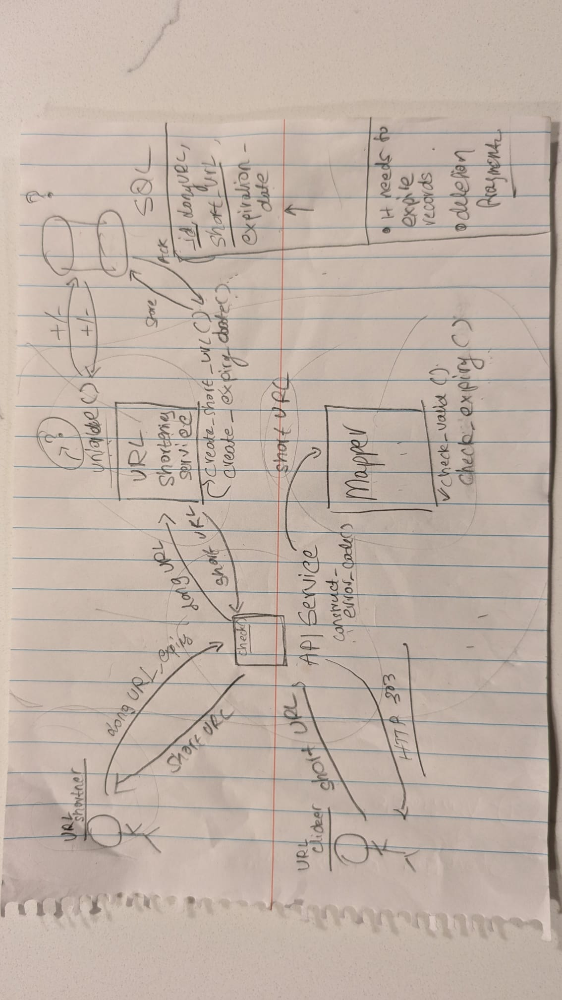

# URL Shortening Service

This repository contains code for a simple Python based URL shortening service. The steps to run the service are provided below. An explanation of the design and deployment considerations are provided after the instructions.

Please ensure that you have Python and Docker installed on your system prior to following the below steps.

## Installation and demo instrcutions

1. Clone the repository:

   ```bash
   git clone https://github.com/Chegde8/URL_Shortener.git
   ```

2. Navigate to the project directory:

   ```bash
   cd URL_Shortener/url-shortening-service
   ```

3. Install the required packages:

   ```bash
   # create a virtual environment
   make install-activate-venv
   
   # activate the virtual environment
   source url-shortening-service/venv/bin/activate
   
   # If you encounter issues with the above command, please create a Python3 virtual environment, activate the environment and install required packages. The below commands ca be used for this:
   pip install virtualenv
   python3 -m venv url_shortener_env
   source url_shortener_env/bin/activate
   pip install -r requirements.txt

   # install the required packages
   make install-deps
   ```
   
4. Build database:

   ```bash
   make build-db
   ```

5. Run the server:

   ```bash
    # Setup the database
    make setup-db

    # Run the server
   make run-flask
   ```

6. Run the tests:
   Please open a new terminal window and run the following command:
   ```bash
   cd url-shortening-service
   ```


   ```bash
   # We need manual intervention to run the tests by making a request to the server
   echo "First we will insert a new URL"
   curl -X POST -H "Content-Type: application/json" -d '{"original_url":"http://www.short.com"}' http://localhost:5000/shorten
   # "http://www.short.com" can be replaced with any URL of your choice.
   
   ## The output will be something like this: {"short_url":"http://shorten.url/GJ7fXl"}
   ## Copy that short url and replace it in the next command

   echo "Now we will retrieve the URL"
   curl -X POST -H "Content-Type: application/json" -d '{"short_url":"http://shorten.url/GJ7fXl"}' http://localhost:5000/expand
   # "http://shorten.url/-GJ7fXl" should be replaced with the short URL you obtained when you ran the command to generate a short URL.
   ```

7. Clean up:
    ```bash
    # deactivate virtual environment
    deactivate

    # remove virtual environment
    make clean
    ```


## Design and deployment considerations
### Functional requirements
1. Given a long (original) URL, generate a short URL.
2. Given the short URL, redirect to the original URL.
3. Expire short URLs after a certain expiry time.

### Scope
1. Generating short URL given long URL: 
   
   a. Assume that long URL is alphanumeric and can contain special characters.

   b. Short URLs need to be unique compared to all non-expired short URLs.

   c. If a non-unique URL is created, rerun the short URL creation N times until a unique short URL is created. Default N is 5.

   d. Short URLs need to be within N characters long (e.g., 20 characters).

2. Redirecting to original URL given short URL:
   
   a. Return redirect error code and long URL.

3. Expiring short URLs:
   
   a. Expire short URLs after N number of days. N can be a user input. Default is 1 day.

   b. Expiry time will be in UTC.

   c. If a URL has expired and is tried to access, error will say that URL does not exist. Memory of expired URLs will be cleared every 24 hours.

4. User interface: Developing a user interface is out of scope. The service will be accessed via command line API calls.

### Operational requirements
1. Scalable: The service should be able to store large number of short URLs and handle high traffic.
2. Availability: The service should be available 24/7.
3. Robustness: The service should be able to handle errors gracefully.
4. Extensibility: The service should be able to add new features easily.
5. Performance: The service should be able to handle requests in a timely manner.

### Design
A rough image of the design is provided below:



The design consist of the following components:
1. **User**: The user interacts with the service by sending requests to the service.
2. **Gateway**: Handles the incoming requests and routes them to the appropriate service.
3. **Service**: Contains the business logic of the service. It interacts with the database to store and retrieve the URLs. Each service is designed to be a separate unit to allow for easy extensibility and scalability.
4. **Database**: This the storage for the URLs.

For storage Sql database was used. Using a SQL database allows for a scalable design and low latency while accessing and searching through large amounts of data. The code was written to be easily extensible and scalable by creating separate classes for each unit. More explained below.

The code consists of three main parts: the main file, controllers and services. The main file is the entry point of the service. It initializes the Flask app and sets up the routes. The controllers handle the incoming requests and call the services. The services contain the business logic of the service.


#### Database design

First of all I chose to use a SQL database to store the URLs. The reason for this is that SQL databases are good for storing structured data and are good for searching through large amounts of data.

The short_url is the primary key of the table. This is because the short URL needs to be unique and is used to retrieve the original URL. It is also stored as a VARCHAR of 60 length to allow for expansion in the future. This adheres to extensibility and malleability of the design in the future. The original URL is stored as a TEXT field. This is because the original URL can be of any length. The expires_at field is a DATETIME field. This is because we need to store the expiry time of the URL.

The database schema is as follows:
```
CREATE TABLE urls (
    id INT IDENTITY(1,1) UNIQUE NOT NULL,
    short_url VARCHAR(60) PRIMARY KEY NOT NULL,
    original_url TEXT NOT NULL,
    expires_at DATETIME
);
```

To accomadate the expiry of ULRs, we have a field called expiry_time. At the time of the creation of the URL, we will add the current time and the expiry time to the expiry_time field. There are a couple of ways to handle aging out of the short URLs.

1. We can have a cron job or a service that runs at a scheduled intervals to delete the expired URLs. This will be a batch process. Meaning it will run infrequently and delete all the expired URLs at once. The ways to implement this would be
   1. A cron job that is scheduled on the SQL server to run at a specific time. This will however impact the performance of the server as the cron job will be running on the same server.
   2. An external service that runs at a specific time and deletes the expired URLs. This will be a more scalable solution as the service can be run on a different server and can be scaled independently of the SQL server.
2. Coupled with the above would be to have a check in the code that checks if the URL is expired before returning the URL. This will ensure that the URL is not returned if it is expired. This will however increase the latency of the service as the check will be done on every request.

### Suggestions for improvements
1. The service can be deployed on multiple servers and all servers can access the same database. The database can be replicated to ensure high availability.
2. The service can be deployed on a cloud provider like AWS or Azure to handle variable traffic - with load balancers and auto-scaling groups.
3. Features linke link preview and clicks per URL can be added. 
4. Use cache for frequently accessed URLs to reduce number of accesses to SQL database.
